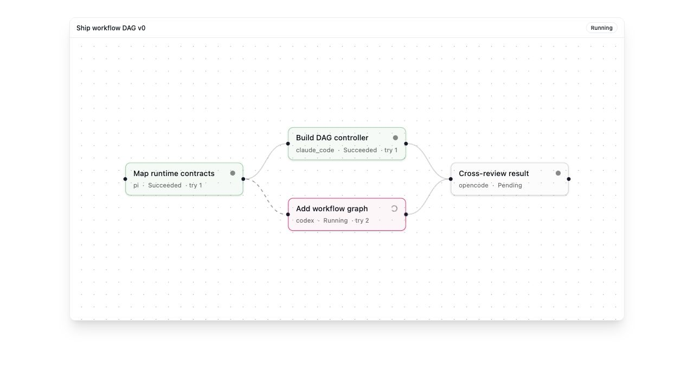

# Polly workflows v0

Polly can submit a static directed acyclic graph (DAG) when a coding task has
explicit dependencies. This is the WS1 slice: deterministic scheduling and
real child-session execution, without worktree conflict management or gates.

Each definition has an `id`, `name`, version, execution budget, and nodes. A
node declares its dependencies, worker agent, role, acceptance contract,
optional model and cost reservation, retry limit, and JSON output schema. Node
IDs must be unique, dependencies must exist, and the graph must be acyclic.

The lifecycle is:

1. `sys_workflow_submit` validates and stores a draft.
2. Polly presents the static graph and budget to the user.
3. `sys_workflow_start` supplies the exact version and definition hash. A
   policy asks the user to approve each new hash.
4. The controller dispatches ready nodes in critical-path order, bounded by
   concurrency, dispatch, and cost budgets. Independent nodes run in parallel.
5. Child completions go privately to the controller. Their final
   `<workflow_result>` JSON is checked against the node schema. Retryable
   failures reuse the child session until `max_attempts` is exhausted.
6. Polly receives one wake when the run succeeds or blocks and reads the
   decision summary with `sys_workflow_get`.

`sys_workflow_amend` creates a new version but can only change nodes that have
not started. `sys_workflow_cancel` interrupts running children. Duplicate and
stale child completions are ignored.

The feature is opt-in through the agent's `workflows` block. State is held in
the runner's in-memory store and is lost on restart; v0 makes no durability or
recovery claim.

Deferred work:

- WS2: worktree ownership, write-set tracking, conflict detection, and merge
coordination.

- WS3: validation gates, speculative branches, and dynamic graph expansion.
